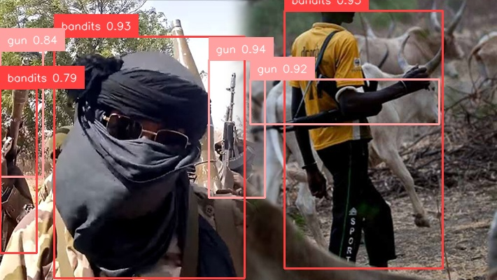

# 📦 Bandits Detection Full-Stack Project

[](https://www.python.org/downloads/)
[](https://reactnative.dev/)
[](https://expo.dev/)
[](https://flask.palletsprojects.com/)
[](https://opensource.org/licenses/MIT)





This repository contains a full-stack object detection system designed to identify and monitor potential threats, specifically targeting individuals labeled as "bandits." The project consists of a Python backend powered by Flask, a mobile application built with React Native (Expo), and a YOLOv8-based machine learning model for real-time object detection.

## 🇳🇬 Context: Banditry in Nigeria

The term "bandits" in this project's context refers to the armed criminal groups operating primarily across Nigeria’s Northwest and North Central states. Unlike insurgent groups, these bandits are largely motivated by economic gains, engaging in mass kidnapping for ransom, cattle rustling, and violence against local communities. This socio-political and security challenge has resulted in significant humanitarian crises, displacement, and disruption of agricultural activities, making visual identification and monitoring of their activities a key area for security-related computer vision applications.

## 🚀 Project Overview

The project is divided into three main components:

1.  **Backend (`backendApp/`):** A Python Flask server that handles user authentication, data processing, and serves as the API endpoint for the mobile application.
2.  **Mobile App (`mobileApp/`):** A cross-platform application built with React Native and Expo, providing a user interface for logging in, viewing system status, and interacting with the detection system.
3.  **Machine Learning (`Test/`):** Contains scripts and notebooks (`train.py`, `Bandits Analysis.ipynb`) for training the YOLOv8 object detection model on a custom dataset.

### Features
-   User registration and authentication system.
-   A mobile dashboard to interact with the system.
-   A robust backend to manage users and requests.
-   A custom-trained YOLOv8 model for detecting specific objects/persons.

## 🛠️ Technologies Used

-   **Backend:** Python, Flask, Flask-Cors, PyMongo, JWT
-   **Mobile App:** React Native, Expo, Expo Router
-   **Database:** MongoDB
-   **Machine Learning:** PyTorch, Ultralytics (YOLOv8), OpenCV

## ⚙️ Installation on a Linux Server

These instructions will guide you through setting up both the backend and mobile application development environment.

### Prerequisites

-   Git
-   Python 3.10+ and Pip
-   Node.js and npm
-   MongoDB installed and running on its default port (27017).

### 1. Clone the Repository

```bash
git clone <your-repository-url>
cd banditsProject
```

### 2. Backend Setup (`backendApp/`)

The backend server is the core of the system.

```bash
cd backendApp

# Create and activate a virtual environment
python3 -m venv venv
source venv/bin/activate

# Install the required Python packages
pip install -r requirements.txt

# Create the .env file for environment variables
touch .env
```

Now, open the `.env` file and add the following line. Replace `"your_super_secret_key"` with a strong, unique secret key.

```env
SECRET_KEY="your_super_secret_key"
```

**Note on Database:** The application is currently configured to connect to a MongoDB instance at `mongodb://localhost:27017/`. For a production environment, it is highly recommended to modify `backendApp/Database/mongo.py` to use an environment variable for the MongoDB connection string.

**Running the Backend:**

```bash
# Make sure your virtual environment is activated
flask run --host=0.0.0.0 --port=3001
```

The backend API will now be accessible at `http://<your_server_ip>:3001`.

### 3. Mobile App Setup (`mobileApp/`)

The mobile app is used to interact with the backend. These steps are for setting up the development environment.

```bash
# Navigate to the mobile app directory from the project root
cd ../mobileApp

# Install npm dependencies
npm install

# Create the .env file for the API URL
touch .env
```

Open the newly created `.env` file and add the URL of your backend server. Replace `<your_server_ip>` with the actual IP address of your Linux server.

```env
serverUrl=http://<your_server_ip>:3001
```

**Running the Mobile App (Development):**

To run the mobile app, you will typically use the Expo Go app on your mobile device or an emulator.

```bash
# Start the Expo development server
npx expo start
```

Scan the QR code generated by the Expo server with the Expo Go app on your phone to run the application.

## 👤 Author

-   **Mbonu Chinedum**

## 📄 License

This project is licensed under the MIT License - see the [LICENSE.md](LICENSE.md) file for details.
