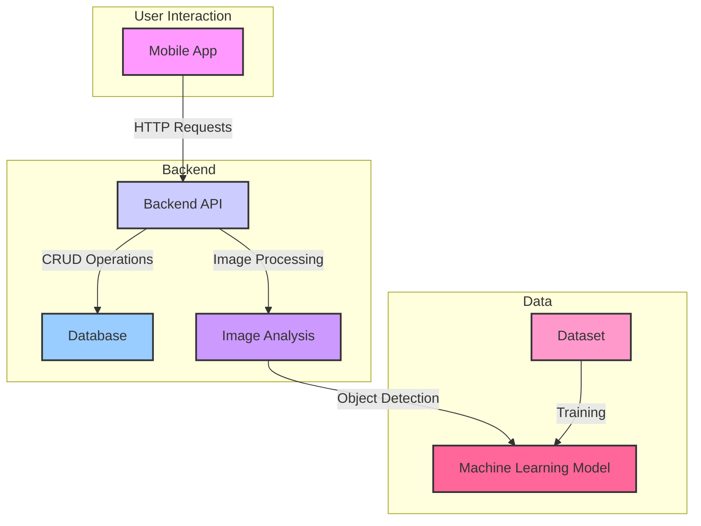

This diagram illustrates the following flow:
1. The user interacts with the **Mobile App**.
2. The **Mobile App** sends requests to the **Backend API**.
3. The **Backend API** processes requests, interacts with the **Database**, and uses the **Image Analysis** module.
4. The **Image Analysis** module uses a **Machine Learning Model** for object detection.
5. The **Machine Learning Model** is trained on the **Dataset**.
